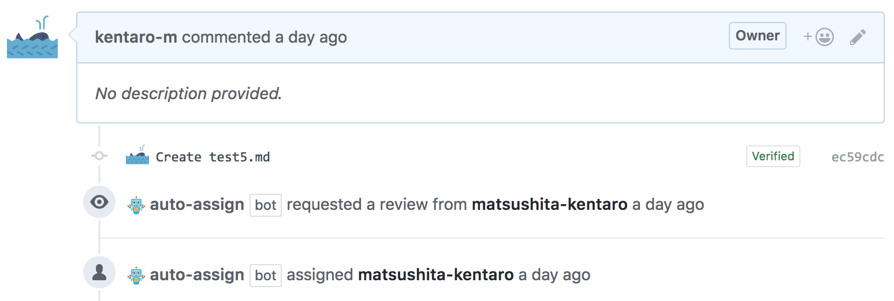

# Probot: Auto Assign
[](https://circleci.com/gh/kentaro-m/auto-assign)
[](https://coveralls.io/github/kentaro-m/auto-assign?branch=master)


WIP :construction_worker:

> A GitHub App built with [Probot](https://github.com/probot/probot) that adds reviewers to pull requests when pull requests are opened.



## Usage
1. Install the app. 
2. Create `.github/auto_assign.yml` in your repository.

```yaml
# Set to true to add reviewers to pull requests
addReviewers: true

# Set to true to add assignees to pull requests
addAssignees: true

# A list of reviewers to be added to pull requests (GitHub user name)
reviewers: 
  - reviewerA
  - reviewerB
  - reviewerC

# A list of keywords to be skipped the process that add reviewers if pull requests include it 
skipKeywords:
  - wip

# A number of reviewers added to the pull request
# Set 0 to add all the reviewers (default: 0)
numberOfReviewers: 0
```

## Development

```sh
# Install dependencies
npm install

# Run typescript
npm run build

# Run the bot
npm start
```

## Deploy

### Glitch

[](https://glitch.com/edit/#!/import/github/kentaro-m/auto-assign)

1. [Configure a new app on Github](https://github.com/settings/apps/new).
    * For the Homepage URL, use your repository url or your homepage url: `https://random-word.glitch.me/probot`.
    * For the Webhook URL, use this URL (again, updating the domain to match yours): `https://random-word.glitch.me/`. Notice that we left off the `/probot`.
    * For the Webhook Secret, just use "development". Input the same value in `.env` file.
    * On the **Permissions & webhooks** tab, add read and write permissions for pull requests.
    * On the **Permissions & webhooks** tab, subscribe to **Pull request** events.
    * Save your changes.
    * Download the private key.
2. Click the **Install** tab, and install your app into one of your repositories.
3. Click the **New File** button (at left) and type `.data/private-key.pem`. Then click **Add File**. Copy the contents of the private key you downloaded after creating the app, paste it into the new file in Glitch.
4. Edit the `.env` file (at left) with your app credentials.
    * Check the example as below.
5. Wait for app to load. A green `Live` label should show up next to the **Show** button when it's finished loading.

```
# The ID of your GitHub App; You can find this in the About section of your Github app
APP_ID=
 
# The Webhook Secret; This is generated by you and then inputted in the settings of your Github app.
WEBHOOK_SECRET=development

# The path to a private key file; This is set by you and then set the contents of the private key you downloaded after creating the app. 
PRIVATE_KEY_PATH=.data/private-key.pem
```

## Contributing

If you have suggestions for how kentaro-m could be improved, or want to report a bug, open an issue! We'd love all and any contributions.

For more, check out the [Contributing Guide](CONTRIBUTING.md).

## License

[ISC](LICENSE) © 2018 Kentaro Matsushita
