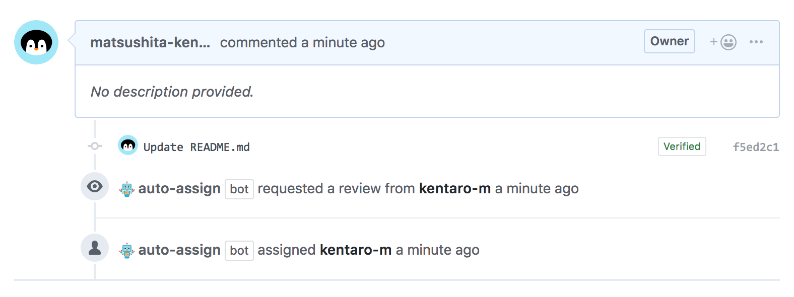

# Probot: Auto Assign
> A GitHub App built with [Probot](https://github.com/probot/probot) that adds reviewers/assignees to pull requests when pull requests are opened.



## How it works
* When the pull request is opened, automatically add reviewers/assignees to the pull request.
* If the number of reviewers is specified, randomly add reviewers/assignees to the pull request.
* If reviewers/assignees are separated into groups in the config file, randomly select the number of reviewers from each group.
* If the title of the pull request contains a specific keyword, do not add reviewers/assignees to the pull request.

## Usage
1. [Install the app](https://github.com/apps/auto-assign).
2. Create `.github/auto_assign.yml` in your repository with the following.

### Single Reviewers List
Add reviewers/assignees to the pull request based on single reviewers list.

```yaml
# Set to true to add reviewers to pull requests
addReviewers: true

# Set to true to add assignees to pull requests
addAssignees: false

# A list of reviewers to be added to pull requests (GitHub user name)
reviewers:
  - reviewerA
  - reviewerB
  - reviewerC

# A number of reviewers added to the pull request
# Set 0 to add all the reviewers (default: 0)
numberOfReviewers: 0

# A list of assignees, overrides reviewers if set
# assignees:
#   - assigneeA

# A number of assignees to add to the pull request
# Set to 0 to add all of the assignees.
# Uses numberOfReviewers if unset.
# numberOfAssignees: 2

# A list of keywords to be skipped the process that add reviewers if pull requests include it
# skipKeywords:
#   - wip

# A list of users to be skipped by both the add reviewers and add assignees processes
# skipUsers:
#   - dependabot[bot]
```

#### Add Github Team to Single Reviewers List

Add Github team to the pull request based on single reviewers list using the `org/team_slug` or `/team_slug` syntax.

```yaml
# Set to true to add reviewers to pull requests
addReviewers: true

# Set to true to add assignees to pull requests
addAssignees: false

# A list of team reviewers to be added to pull requests (GitHub team slug)
reviewers:
  - org/teamReviewerA
  - org/teamReviewerB
  - /teamReviewerC

# Number of reviewers has no impact on Github teams
# Set 0 to add all the reviewers (default: 0)
numberOfReviewers: 0

# A list of assignees, overrides reviewers if set
# assignees:
#   - assigneeA

# A number of assignees to add to the pull request
# Set to 0 to add all of the assignees.
# Uses numberOfReviewers if unset.
# numberOfAssignees: 2

# A list of keywords to be skipped the process that add reviewers if pull requests include it
# skipKeywords:
#   - wip
```

>Note: Number of reviewers has currently no impact on Github teams and all teams will be added as reviewers.

>Note: This feature is not enabled in the hosted app below.  
https://github.com/apps/auto-assign  
To enable the team assignment, you need to host your own app and change the permission below that the app can read the organization's team.  
- Repository permissions
  - `Administration` - `Read-Only`
- Organization permissions
  - `Members` - `Read-Only`

### Multiple Reviewers List
Add reviewers/assignees to the pull request based on multiple reviewers list.

If you and peers work at the separate office or they work at the separate team by roles like frontend and backend, you might be good to use adding reviewers from each group.

```yaml
# Set to true to add reviewers to pull requests
addReviewers: true

# Set to true to add assignees to pull requests
addAssignees: false

# A number of reviewers added to the pull request
# Set 0 to add all the reviewers (default: 0)
numberOfReviewers: 1

# A number of assignees to add to the pull request
# Set to 0 to add all of the assignees.
# Uses numberOfReviewers if unset.
# numberOfAssignees: 2

# Set to true to add reviewers from different groups to pull requests
useReviewGroups: true

# A list of reviewers, split into different groups, to be added to pull requests (GitHub user name)
reviewGroups:
  groupA:
    - reviewerA
    - reviewerB
    - reviewerC
  groupB:
    - reviewerD
    - reviewerE
    - reviewerF

# Set to true to add assignees from different groups to pull requests
useAssigneeGroups: false

# A list of assignees, split into different froups, to be added to pull requests (GitHub user name)
# assigneeGroups:
#   groupA:
#     - assigneeA
#     - assigneeB
#     - assigneeC
#   groupB:
#     - assigneeD
#     - assigneeE
#     - assigneeF

# A list of keywords to be skipped the process that add reviewers if pull requests include it
# skipKeywords:
#   - wip
```

### Assign Author as Assignee
Add the PR creator as assignee to the pull request.

```yaml
# Set to author to set pr creator as assignee
addAssignees: author
```

## Advantage

### Use Auto Assign in combination with code owners
If you want to add the same reviewers every time the pull request is opened, you can use code owners. Also, if you want to add randomly reviewers, you can use this app together.

[About code owners - GitHub Help](https://help.github.com/en/articles/about-code-owners)

## Development

```sh
# Install dependencies
npm install

# Run typescript
npm run build

# Run the bot
npm start

# Test before submitting a PR
npm test
```

See [Contributing](#contributing) for more information about making improvements to `auto-assign`.

## Deploy

This app can be deployed in two ways:
- **Node.js App**: Traditional server-based deployment (Glitch, Heroku, etc.)
- **Serverless Function**: Function-as-a-Service deployment (Vercel, Netlify, etc.)

### Serverless Function

#### Vercel

1. [Configure a new app on GitHub](https://github.com/settings/apps/new).
   * For the Homepage URL, use your repository URL: `https://github.com/your-username/your-repo`
   * For the Webhook URL, use: `https://your-vercel-domain.vercel.app/api/github/webhooks`
   * Generate a Webhook Secret with `openssl rand -base64 32` and save it
   * On the **Permissions & webhooks** tab, add read/write permissions for pull requests
   * On the **Permissions & webhooks** tab, subscribe to **Pull request** events
   * Save your changes and download the private key

2. Deploy to Vercel:
   * Connect your GitHub repository to Vercel
   * Set the following environment variables in Vercel dashboard:
     ```
     APP_ID=your_github_app_id
     WEBHOOK_SECRET=your_webhook_secret
     PRIVATE_KEY=your_private_key_content
     ```
   * Deploy the app

3. Install the GitHub App:
   * Go to your GitHub App settings
   * Click the **Install** tab
   * Install the app to your repositories

The serverless function will automatically handle GitHub webhook events at `/api/github/webhooks`.

### Node.js App

#### Glitch

[](https://glitch.com/edit/#!/import/github/kentaro-m/auto-assign)

1. [Configure a new app on Github](https://github.com/settings/apps/new).
    * For the Homepage URL, use your repository url or your homepage url: `https://random-word.glitch.me/probot`.
    * For the Webhook URL, use this URL (again, updating the domain to match yours): `https://random-word.glitch.me/`. Notice that we left off the `/probot`.
    * For the Webhook Secret, just use "development". Input the same value in `.env` file.
    * On the **Permissions & webhooks** tab, add read/write permissions, read metadata and read single file (`.github/auto_assign.yml`) for pull requests.
    * On the **Permissions & webhooks** tab, subscribe to **Pull request** events.
    * Save your changes.
    * Download the private key.
2. Click the **Install** tab, and install your app into one of your repositories.
3. Click the **New File** button (at left) and type `.data/private-key.pem`. Then click **Add File**. Copy the contents of the private key you downloaded after creating the app, paste it into the new file in Glitch.
4. Edit the `.env` file (at left) with your app credentials.
    * Check the example as below.
5. Wait for app to load. A green `Live` label should show up next to the **Show** button when it's finished loading.

```
# The ID of your GitHub App; You can find this in the About section of your Github app
APP_ID=

# The Webhook Secret; This is generated by you and then inputted in the settings of your Github app.
WEBHOOK_SECRET=development

# The path to a private key file; This is set by you and then set the contents of the private key you downloaded after creating the app.
PRIVATE_KEY_PATH=.data/private-key.pem
```

### GitHub Actions
If you want to use the auto-assign app using GitHub Actions, refer to the following link. Also, because of providing the GitHub action for a new version (GitHub Actions v2; YAML format), the previous version (GitHub Actions v1; HCL format) is deprecated.

[kentaro-m/auto-assign-action: An action which adds reviewers to the pull request when the pull request is opened.](https://github.com/kentaro-m/auto-assign-action)

## Contributing

If you have suggestions for how `auto-assign` could be improved, or want to report a bug, open an issue! We'd love all and any contributions.

For more, check out the [Contributing Guide](CONTRIBUTING.md).

## License

[ISC](LICENSE) © 2018 Kentaro Matsushita
